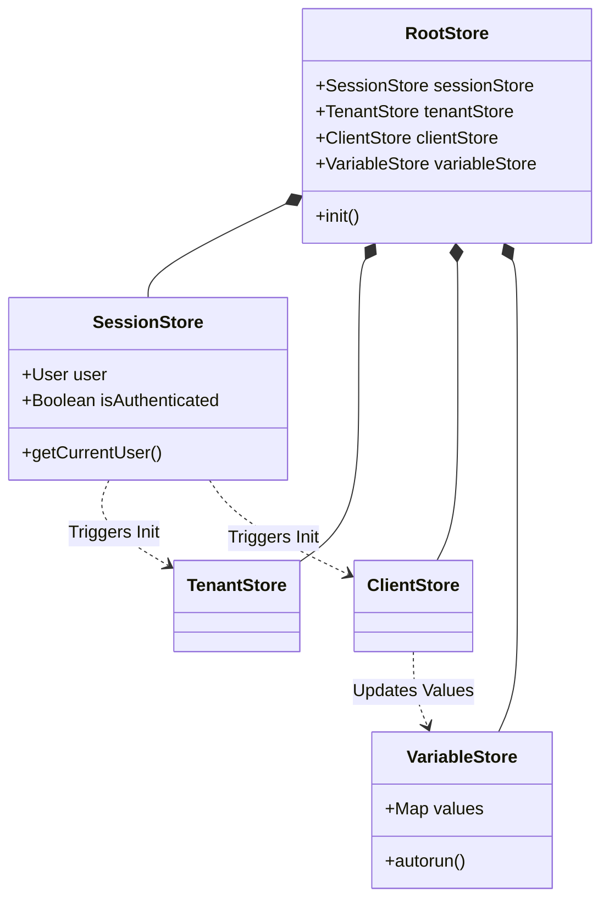
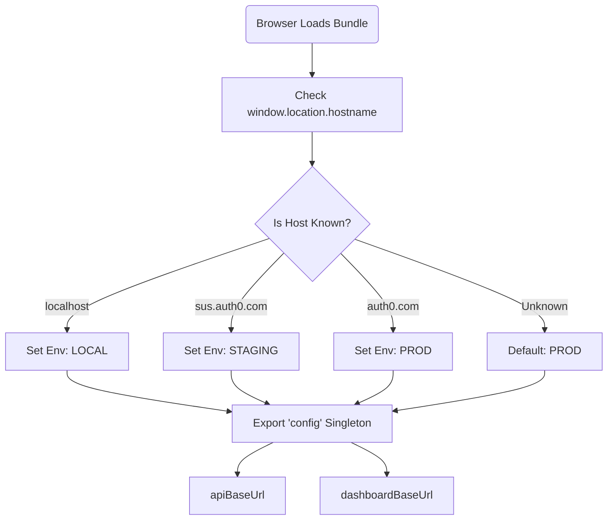
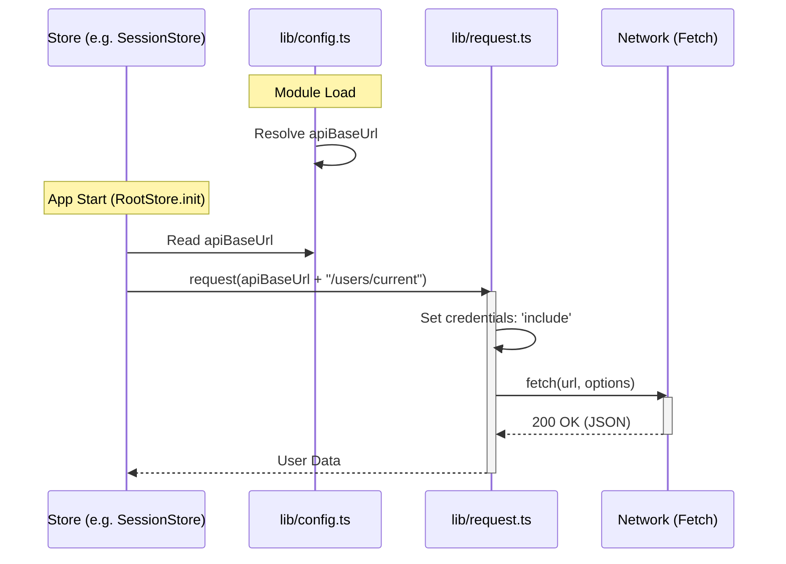
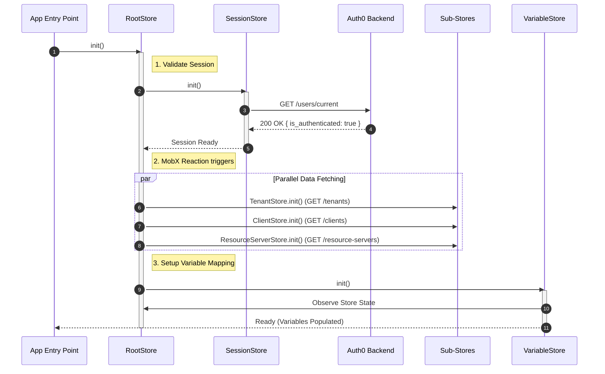
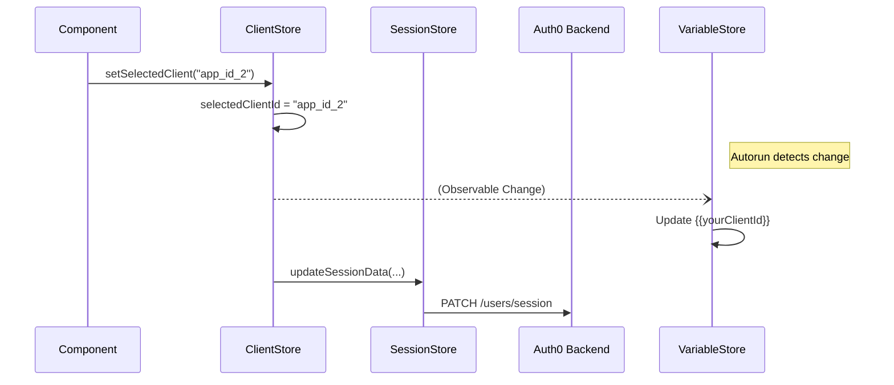
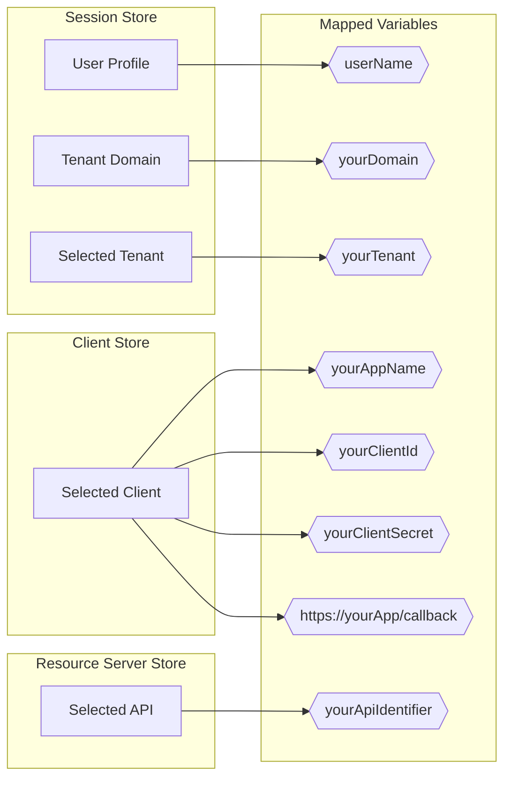

# Auth0 Docs UI Library

A shared React component library for Auth0 documentation sites, built with React 19, TailwindCSS 4, and MobX 6.

## Overview

This package provides reusable UI components and state management for Auth0 documentation sites. It's built as a **UMD (Universal Module Definition)** bundle that exposes components globally via `window.Auth0DocsUI` for use in Mintlify-based documentation.

## Prerequisites

- **Node.js 24+**
- **pnpm** - Package manager

## Technology Stack

- **React 19.1.1** - UI framework
- **TypeScript 5.8.3** - Type safety and development experience
- **Vite 7.1.7** - Build tool and dev server
- **TailwindCSS 4.1.13** - Utility-first CSS framework
- **MobX 6.15.0** - State management
- **Radix UI** - Accessible component primitives
- **Lucide React** - Icon library

## Quick Start

### Installation

```bash
pnpm install
```

### Development

```bash
pnpm dev
# Starts Vite dev server at http://localhost:5173
```

### Build and Deploy

```bash
pnpm copy:build
# Builds UMD bundle and copies artifacts to /main/ui/ directory
```

> **Note:** The `pnpm copy:build` command runs both `pnpm build` (TypeScript compilation + Vite bundling) and copies the output to the documentation site. You don't need to run `pnpm build` separately.

## Build Process

### How It Works

The `pnpm copy:build` command handles the complete build and deployment workflow:

1. **TypeScript Compilation** - `tsc -b` compiles all TypeScript files
2. **Vite Build** - Bundles into UMD format with version-stamped filenames
3. **Copy to Main** - Removes old build artifacts and copies new ones to `/main/ui/` directory

### Build Configuration

### Entry Points

This package has **two entry points** serving different purposes:

| File | Purpose | Usage |
|------|---------|-------|
| **`src/index.tsx`** | Production build entry point | Used by Vite for bundling the UMD library. Exports all components, stores, and utilities for consumption in documentation sites via `window.Auth0DocsUI`. |
| **`src/main.tsx`** | Development entry point | Used **only for local development** with `pnpm dev`. Renders a test application for developing and previewing components in isolation. **Not included in production bundle.** |

**Important:** When adding new components, export them from `index.tsx` to make them available in the production bundle. The `main.tsx` file is purely for local testing and has no impact on the deployed library.

**Output Format:** UMD (Universal Module Definition)
- **JavaScript:** `auth0-docs-ui-{version}.umd.js`
- **CSS:** `auth0-docs-ui-{version}.css`
- **Global Name:** `Auth0DocsUI` (accessible as `window.Auth0DocsUI`)

**Vite Configuration** (`vite.config.ts`):
```typescript
build: {
  lib: {
    entry: './src/index.tsx',
    name: 'Auth0DocsUI',
    fileName: () => `auth0-docs-ui-${pkg.version}.umd.js`,
    formats: ['umd'],
  }
}
```

### Version Management

The build automatically includes the version from `package.json` in the output filenames:

```
ui/package.json (version: 1.1.0)
    ↓
ui/dist/auth0-docs-ui-1.1.0.umd.js
ui/dist/auth0-docs-ui-1.1.0.css
    ↓
main/ui/auth0-docs-ui-1.1.0.umd.js
main/ui/auth0-docs-ui-1.1.0.css
```

**To update the version:**
1. Edit `version` in `ui/package.json`
2. Run `pnpm copy:build`
3. Commit both `/ui` and `/main/ui/` changes

### CSS Scoping Strategy

All CSS is scoped to prevent conflicts with Mintlify's default styles:

- **CSS Module Naming:** `auth0-[name]__[local]___[hash:base64:5]`
- **TailwindCSS Prefix:** `adu:` on all utility classes
- **Custom Properties:** Prefixed with `--adu-`

Example:
```css
/* Generated CSS class */
.auth0-Button__primary___a1b2c

/* TailwindCSS utility */
.adu:bg-blue-500
```

## Integration with Documentation Sites

### How Mintlify Loads the UI Bundle

Mintlify automatically discovers and loads JavaScript/CSS files from the `/ui` directory in each documentation site:

```
main/
├── docs.json           # Mintlify configuration
├── ui/                 # UI bundle directory
│   ├── auth0-docs-ui-1.1.0.umd.js
│   └── auth0-docs-ui-1.1.0.css
└── [docs content]
```

**No manual configuration needed** - Mintlify detects these files during build and injects them into all documentation pages.

### Accessing Components in Documentation

Once loaded, all components and utilities are available via the global `window.Auth0DocsUI` object:

```javascript
// Example: QuickstartButtons.jsx
await window.Auth0DocsUI?.getSample({
  repo: 'auth0-express-webapp-sample',
  branch: 'master',
  path: '01-Login'
});
```

### Current Integration Points

**Main Documentation** (`/main`)
- ✅ UI bundle deployed to `/main/ui/`
- Used in: `/main/snippets/QuickstartButtons.jsx`

**Auth4GenAI Documentation** (`/auth4genai`)
- ❌ No UI bundle currently deployed
- Can be added by copying build output to `/auth4genai/ui/`

## Exported Components and APIs

All exports are available via `window.Auth0DocsUI`. See `/ui/src/index.tsx` for the complete list of exported components.

### State Management

```javascript
// Initialize MobX store
window.Auth0DocsUI.initRootStore();

// Access store instance
const store = window.Auth0DocsUI.rootStore;

// MobX utilities
const { autorun, observe, reaction, observer } = window.Auth0DocsUI;
```

**Store Architecture:**
- `SessionStore` - User authentication state
- `ClientStore` - Client application data
- `TenantStore` - Tenant/environment selection
- `ResourceServerStore` - Resource server configuration
- `VariableStore` - Variables for sample downloads

### API Utilities

```javascript
// Download sample application
await window.Auth0DocsUI.getSample({
  repo: 'auth0-express-webapp-sample',
  branch: 'master',
  path: '01-Login'
});

// Download sample with credentials
await window.Auth0DocsUI.postSample({
  repo: 'auth0-express-webapp-sample',
  credentials: { ... }
});
```

## Architecture

### Directory Structure

```
ui/
├── src/
│   ├── components/          # React components
│   │   ├── ui/             # shadcn/ui base components
│   │   └── [feature]/      # Feature-specific components
│   ├── stores/             # MobX state management
│   │   ├── root-store.ts   # Central store container
│   │   ├── session.ts      # User session
│   │   ├── client.ts       # Client applications
│   │   ├── tenant.ts       # Tenant management
│   │   └── ...
│   ├── lib/                # Utilities and helpers
│   ├── index.tsx           # Main export file
│   └── index.css           # Global styles
├── scripts/
│   └── copy-build.sh       # Deployment script
├── vite.config.ts          # Build configuration
├── package.json            # Dependencies and scripts
└── tsconfig.json           # TypeScript configuration
```

### Component Development Patterns

**Using MobX Observables:**
```tsx
import { observer } from 'mobx-react-lite';
import { rootStore } from '@/stores';

export const MyComponent = observer(() => {
  const { sessionStore } = rootStore;

  return <div>{sessionStore.user?.name}</div>;
});
```

**Using Radix UI Primitives:**
```tsx
import * as DropdownMenu from '@radix-ui/react-dropdown-menu';

export const Menu = () => (
  <DropdownMenu.Root>
    <DropdownMenu.Trigger>Open</DropdownMenu.Trigger>
    <DropdownMenu.Content>
      <DropdownMenu.Item>Item 1</DropdownMenu.Item>
    </DropdownMenu.Content>
  </DropdownMenu.Root>
);
```

**Using TailwindCSS:**
```tsx
// Use adu: prefix for all utilities
export const Button = () => (
  <button className="adu:bg-blue-500 adu:text-white adu:px-4 adu:py-2">
    Click me
  </button>
);
```

## Development Workflow

### Making Changes to UI Components

1. **Make your changes** in `/ui/src/`
   ```bash
   cd ui
   pnpm dev  # Start dev server to test changes
   ```

2. **Build and deploy to documentation site**
   ```bash
   pnpm copy:build
   ```
   This command:
   - Compiles TypeScript (`tsc -b`)
   - Builds UMD bundle (`vite build`)
   - Creates `dist/auth0-docs-ui-1.1.0.umd.js` and `.css`
   - Copies artifacts to `/main/ui/`

3. **Test in documentation**
   ```bash
   cd ../main
   mint dev  # Start Mintlify dev server
   ```
   Open http://localhost:3000 and verify your changes

4. **Commit changes**
   ```bash
   git add ui/ main/ui/
   git commit -m "Update UI component: [description]"
   git push
   ```

### Version Bumping Strategy

**When to bump version:**
- **Major (2.0.0)** - Breaking API changes
- **Minor (1.2.0)** - New features, new components
- **Patch (1.1.1)** - Bug fixes, style tweaks

**How to bump:**
1. Update version in `ui/package.json`
2. Run `pnpm copy:build`
3. Commit the version change and new build files

> **Note:** Old build files are automatically removed by the `copy:build` script before copying new ones.

### Code Quality

```bash
# Lint TypeScript and React code
pnpm lint

# Format code with Prettier
pnpm format
```

**Linting Rules:**
- ESLint 9 with TypeScript support
- React Hooks rules enforced
- React Refresh plugin for HMR

## Contributing

### Adding a New Component

1. Create component in `/src/components/[category]/`
2. Export from `/src/components/index.ts`
3. Add to main export in `/src/index.tsx`
4. Build and test
5. Update this README with component documentation

### Adding a New Store

1. Create store in `/src/stores/[name].ts`
2. Extend `RootStore` in `/src/stores/root-store.ts`
3. Export from `/src/stores/index.ts`
4. Document store properties and methods

## Internals

### State Management (MobX Stores)

The heart of the library is the `RootStore`, which orchestrates a collection of domain-specific stores. The architecture follows a strict initialization flow to ensure data dependencies are met before UI rendering.

#### Store Hierarchy



**Store Responsibilities:**

| Store Name | Primary Purpose | Key Data Managed | API Dependency |
| :--- | :--- | :--- | :--- |
| **`RootStore`** | Orchestrates initialization/resetting of all stores based on auth status. | Contains instances of all sub-stores. | None |
| **`SessionStore`** | Manages **user authentication** and basic session context. | `isAuthenticated`, `user`, `domain`, `selectedTenantName`. | `getCurrentUser` |
| **`TenantStore`** | Manages the collection of **available tenants**. | `tenants` (list). | `getTenants` |
| **`ClientStore`** | Manages **Client Applications** and tracks selection. | `clients`, `selectedClientId`. | `getClients` |
| **`ResourceServerStore`** | Manages **APIs** and tracks selection. | `resourceServers`, `selectedApiId`. | `getResourceServers` |
| **`VariableStore`** | **Central mapper** for dynamic code snippet variables. | `values` (Map of `{placeholder}` to `real_value`). | Observes other stores |

### Configuration & API Lifecycle

The library uses a **Runtime Configuration** pattern. Unlike build-time environment variables, the application determines its environment (Local, Dev, Staging, or Prod) dynamically in the browser at the moment the JavaScript bundle loads.

#### 1\. Environment Resolution

As soon as the `auth0-docs-ui` bundle is loaded, `lib/config.ts` inspects `window.location.hostname` to determine which backend services to target.



**Environment Mapping:**

| Environment | Hostname Match | API Root (`apiBaseUrl`) |
| :--- | :--- | :--- |
| **Production** | `auth0.com` | `https://auth0.com/docs/v2` |
| **Staging** | `sus.auth0.com` | `https://sus.auth0.com/docs/v2` |
| **Development** | `tus.auth0.com` | `https://tus.auth0.com/docs/v2` |
| **Local** | `localhost` | `http://localhost:7200/docs/v2` |

#### 2\. Request Resolution

When stores need to fetch data, they import the resolved `config` object. All requests are routed through `lib/request.ts`, which injects the necessary credentials (cookies) and headers.



### API Interaction & Call Sequences

Once the configuration is resolved, the `RootStore` orchestrates the actual data fetching sequence.

#### 1\. Initialization Sequence (Happy Path)

When `RootStore.init()` is called, network requests cascade based on the session state.



#### 2\. Context Switching (Changing Selection)

When a user selects a different Application or API in the UI:

1.  **Optimistic UI Update:** The store updates immediately.
2.  **Persistence:** A call is made to `patchUserSession` to save this preference to the backend.




### Template Variables System

The `VariableStore` is responsible for the "Magic" replacement of placeholders (e.g., `{{yourClientId}}`) in the documentation. It observes changes in the session, client, and API stores and automatically updates the mapped values.

#### Variable Data Flow



#### Variable Catalog

| Placeholder Variable | Description | Source Store |
| :------------------- | :---------- | :----------- |
| `{{yourAppName}}` | Name of the selected Client/Application. | `ClientStore` |
| `{{userName}}` | Name of the authenticated user. | `SessionStore` |
| `{{yourTenant}}` | Name of the selected Tenant. | `SessionStore` |
| `{{yourDomain}}` | Domain of the current Tenant. | `SessionStore` |
| `{{yourClientId}}` | Client ID of the selected Application. | `ClientStore` |
| `{{yourClientSecret}}` | Client Secret of the selected Application. | `ClientStore` |
| `{{https://yourApp/callback}}` | First Callback URL for the selected Application. | `ClientStore` |
| `{{yourApiIdentifier}}` | Identifier (Audience) of the selected API. | `ResourceServerStore` |

## Resources

- [Vite Documentation](https://vitejs.dev/)
- [React 19 Documentation](https://react.dev/)
- [TailwindCSS v4 Documentation](https://tailwindcss.com/docs)
- [MobX Documentation](https://mobx.js.org/)
- [Radix UI Documentation](https://www.radix-ui.com/)
- [Mintlify Documentation](https://mintlify.com/docs)

## License

This package is private and intended for internal use within Auth0 documentation sites only.
